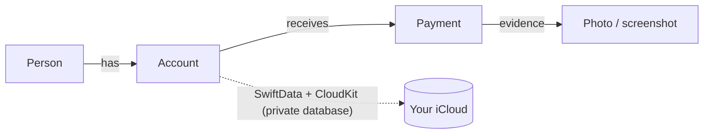

# Freetab

A private ledger for money between you and other people: what you sold or lent on installments, what you owe,
and every payment with its date and a screenshot as evidence. iPhone, iPad and Mac, synced through your own iCloud.
Free, no in-app purchases, no accounts, no servers.

## How It Works

Each **account** is one thing between you and one person — "Lenovo laptop, Juan owes me $ 3.000.000" or "Loan for
the trip, I owe Carlos US$ 500". Every **payment** on it records the amount, date, method, a note and any number of
photos or screenshots of the transfer. Freetab shows what is pending per account, per person and in total, split
into *owed to me* and *I owe*.



- Data lives in SwiftData backed by your **private** CloudKit database: only your Apple ID can read it; the app has
  no backend and collects nothing.
- Amounts are stored as integers in a fixed scale (1/10,000 of the currency unit), so totals are exact and a stored
  value never changes meaning across devices or OS updates. Currency decimals are used only for input and display.
- Evidence images are downscaled before saving (2048 px JPEG + thumbnail) to keep iCloud usage low.
- Optional Face ID / Touch ID lock. English and Spanish.

## Build

Requires Xcode 26 or later and [XcodeGen](https://github.com/yonaskolb/XcodeGen) (`brew install xcodegen`).

```bash
xcodegen generate
open Freetab.xcodeproj
```

iCloud sync needs a signed build with your own team and CloudKit container (`DEVELOPMENT_TEAM` in `project.yml`,
container in `Freetab/Support/Freetab.entitlements`); unsigned builds fall back to a local store.

```bash
# unit tests on the simulator
xcodebuild -scheme Freetab -destination 'platform=iOS Simulator,name=iPhone 17' CODE_SIGNING_ALLOWED=NO test
```

Launch with `-demo` for an in-memory store with sample data (add `-selectFirst` to open the first account).
After adding UI strings, refresh the catalog with `xcrun xcstringstool sync` and `python3 tools/apply_translations.py es`.

## Stack

| Layer | Tool |
|-------|------|
| UI | SwiftUI (iOS, iPadOS, macOS 26) |
| Data / sync | SwiftData + CloudKit private database |
| Tests | Swift Testing |
| Project | XcodeGen (`project.yml`) |

## License

[MIT](LICENSE)
